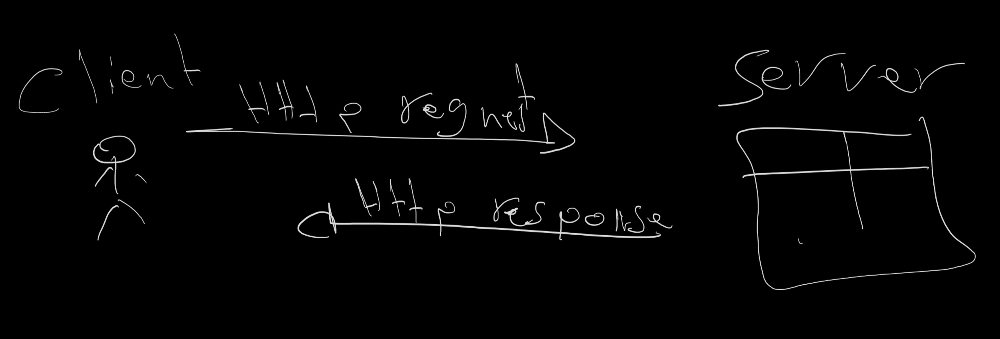

# Movies-Library - Version 1.1

**Author Name**: Mahmoud Nassar

## Overview
Movies-Library is a web application designed to provide detailed information about movies. It includes features for adding, updating, and deleting movies in a PostgreSQL database, as well as fetching data from external APIs such as The Movie DB. Built with Node.js using the Express framework, this application demonstrates how to create and manage web routes that integrate with databases and external services.

## Getting Started
Follow these steps to get the application running on your machine:

1. **Clone the repository:**  
   `git clone https://github.com/Mahmoud1Nassar/Movies-Library.git`

2. **Install dependencies:**  
   Navigate to the project directory and run:  
   `npm install`

3. **Set up environment variables:**  
   Create a `.env` file in the root directory and add your The Movie DB API key:  
   `API_KEY=your_api_key_here`

4. **Start the server:**  
   `npm start`

## Project Features
- **Add Movie Endpoint (`/addMovie`):** Allows users to add a new movie to the database.
- **Get Movies Endpoint (`/getMovies`):** Retrieves a list of movies from the database.
- **Update Movie Endpoint (`/update/:id`):** Updates information about a specific movie in the database.
- **Delete Movie Endpoint (`/deleteMovies/:id`):** Deletes a specific movie from the database.
- **Get Movie by ID Endpoint (`/getMovie/:id`):** Retrieves detailed information about a specific movie from the database.
- **Trending Movies Endpoint (`/trending`):** Fetches and displays trending movies data for the current week from The Movie DB.
- **Search Movies Endpoint (`/search`):** Allows users to search for movies by title using The Movie DB API.
- **Popular Movies Endpoint (`/popular-movies`):** Retrieves a list of currently popular movies from The Movie DB.
- **Top Rated Movies Endpoint (`/top-rated-movies`):** Provides a list of top-rated movies according to The Movie DB.
- **Error Handling:** Functions to handle "500 Internal Server Error" and "404 Not Found" to improve application robustness.

## Updates in Version 1.1
- Added endpoints to add, update, and delete movies in the PostgreSQL database.
- Enhanced error handling and response messages for better user experience.
- Integrated external API calls to fetch trending, popular, and top-rated movies data.
- Updated the project structure to support new features and improve code organization.

## WRRC Diagram

